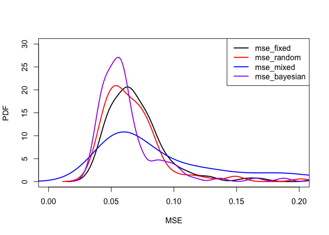

<!-- README.md is generated from README.Rmd. Please edit that file -->

# ATE

<!-- badges: start -->
<!-- badges: end -->

The ATE (additive term extraction) package provides a variety of methods
to estimate site, event, (and path) terms from ground motion residuals.

## Installation

1.  Make sure “tiydverse”, “cmdstanr”, “stringr”,“dplyr”, “lme4”, and
    “magrittr” are installed as they are dependencies. Otherwise, you
    can run the following command to install them. For error and
    warnings when installing “cmdstanr”, please refer to the
    [page](https://mc-stan.org/cmdstanr/).

``` r
install.packages(c("tiydverse", "cmdstanr", "stringr","dplyr", "lme4", "magrittr"))
```

2.  Install utility package “devtools”:

``` r
install.packages("devtools")
```

3.  Lastly, install “ATE” package:

``` r
library(devtools)
install_github('gui33627/ATE')
```

## Example

This is the example code that reproduces the results of the simulation
study in our paper:

``` r
library(ATE)
N <- 100
num_event <- c(20, 50)
num_site <- c(40, 200)

# Simulation with balanced data
for (i in 1:length(num_event)) {

  results_list <- list()
  mse_results <- data.frame(matrix(NA, nrow = N, ncol = 4))

  for (j in 1:N) {
    # generate data
    gm_data <- dgp(num_event = num_event[i], num_site = num_site[i],
                   tau = 1, phi_S2S = 1, phi_SS = 1)

    delta_S2S_fixed <- ATE::stepwise_extraction(gm_data, random = FALSE)
    delta_S2S_random <- ATE::stepwise_extraction(gm_data, random = TRUE)
    delta_S2S_mixed <- ATE::mixed_extraction(gm_data)
    delta_S2S_bayesian <- ATE::bayesian_extraction(gm_data)


    results <- delta_S2S_fixed %>%
      left_join(delta_S2S_random, by = c("site_id" = "site_id")) %>%
      left_join(delta_S2S_mixed, by = c("site_id" = "site_id")) %>%
      left_join(delta_S2S_bayesian, by = c("site_id" = "site_id")) %>%
      rename(delta_S2S.fixed = delta_S2S.x, delta_S2S.random = delta_S2S.y,
             delta_S2S.mixed = delta_S2S.x.x, delta_S2S.bayesian = delta_S2S.y.y)

    mse <- gm_data %>% select(site_id, delta_S2S) %>% unique() %>% arrange(site_id) %>%
      left_join(results, by = c("site_id" = "site_id")) %>%
      mutate(y_fixed = delta_S2S.fixed - delta_S2S,
             y_random = delta_S2S.random - delta_S2S,
             y_mixed = delta_S2S.mixed - delta_S2S,
             y_bayesian = delta_S2S.bayesian - delta_S2S) %>%
      summarise(mse_fixed = sum((y_fixed)^2)/length(y_fixed),
             mse_random = sum((y_random)^2)/length(y_random),
             mse_mixed = sum((y_mixed)^2)/length(y_mixed),
             mse_bayesian = sum((y_bayesian)^2)/length(y_bayesian))

    results_list <- c(results_list, list(results))
    mse_results[j,] <- mse
    print(paste0(i," + ", j," done!"))
  }
  colnames(mse_results) <- colnames(mse)
  write.csv(mse_results, file = paste0("mse_results", i, ".csv"), row.names = FALSE)
}

# Simulation with unbalanced data
N <- 100
num_event <- c(20)
num_site <- c(40)
missingness <- c(0.1, 0.2)


for (k in 1:length(missingness)) {
  for (i in 1:length(num_event)) {

    results_list <- list()
    mse_results <- data.frame(matrix(NA, nrow = N, ncol = 4))

    for (j in 1:N) {
      # generate data
      gm_data <- dgp(num_event = num_event[i], num_site = num_site[i],
                     tau = 1, phi_S2S = 1, phi_SS = 1,
                     missing_percent = missingness[k])

      delta_S2S_fixed <- ATE::stepwise_extraction(gm_data, random = FALSE)
      delta_S2S_random <- ATE::stepwise_extraction(gm_data, random = TRUE)
      delta_S2S_mixed <- ATE::mixed_extraction(gm_data)
      delta_S2S_bayesian <- ATE::bayesian_extraction(gm_data)

      results <- delta_S2S_fixed %>%
        left_join(delta_S2S_random, by = c("site_id" = "site_id")) %>%
        left_join(delta_S2S_mixed, by = c("site_id" = "site_id")) %>%
        left_join(delta_S2S_bayesian, by = c("site_id" = "site_id")) %>%
        rename(delta_S2S.fixed = delta_S2S.x, delta_S2S.random = delta_S2S.y,
               delta_S2S.mixed = delta_S2S.x.x, delta_S2S.bayesian = delta_S2S.y.y)

      mse <- gm_data %>% select(site_id, delta_S2S) %>% unique() %>% arrange(site_id) %>%
        left_join(results, by = c("site_id" = "site_id")) %>%
        mutate(y_fixed = delta_S2S.fixed - delta_S2S,
               y_random = delta_S2S.random - delta_S2S,
               y_mixed = delta_S2S.mixed - delta_S2S,
               y_bayesian = delta_S2S.bayesian - delta_S2S) %>%
        summarise(mse_fixed = sum((y_fixed)^2)/length(y_fixed),
                  mse_random = sum((y_random)^2)/length(y_random),
                  mse_mixed = sum((y_mixed)^2)/length(y_mixed),
                  mse_bayesian = sum((y_bayesian)^2)/length(y_bayesian))

      results_list <- c(results_list, list(results))
      mse_results[j,] <- mse
      print(paste0(k, "+", i," + ", j," done!"))
    }
    colnames(mse_results) <- colnames(mse)
    write.csv(mse_results, file = paste0("mse_results",i, "_missing_", 
                                         missingness[k], ".csv"), row.names = FALSE)
  }
}
```

``` r
mse_small <- read.csv("mse_results1.csv")
mse_large <- read.csv("mse_results2.csv")
mse_small_missing_0.1 <- read.csv("mse_results1_missing_0.1.csv")
mse_small_missing_0.2 <- read.csv("mse_results1_missing_0.2.csv")
```

``` r
colMeans(mse_small)
#>    mse_fixed   mse_random    mse_mixed mse_bayesian 
#>   0.07125706   0.06689887   0.10758496   0.06377722
colMeans(mse_large)
#>    mse_fixed   mse_random    mse_mixed mse_bayesian 
#>   0.02471365   0.02421347   0.03967131   0.02342359
colMeans(mse_small_missing_0.1)
#>    mse_fixed   mse_random    mse_mixed mse_bayesian 
#>   0.08321095   0.07784859   0.10962814   0.07136973
colMeans(mse_small_missing_0.2)
#>    mse_fixed   mse_random    mse_mixed mse_bayesian 
#>   0.08679020   0.08149110   0.11554541   0.07688442
```

The simulation results demonstrate that the Bayesian estimation of site
terms consistently outperforms fixed, random, and mixed effect methods,
achieving the lowest average MSE across all sites. This superior
performance is observed in various scenarios, including small sample
sizes, large sample sizes, and small samples with different percentages
of missing data.

``` r
plot_mse <- function(mse_mat, x_range = c(0, 0.2), y_range = c(0,30)){
  
  mse_x_range <- x_range
  mse_y_range <- y_range
  
  color_list <- c('black', 'red', 'blue', 'purple')
  plot(mse_x_range, mse_y_range, type = 'n', xlab = 'MSE', ylab = 'PDF')
  
  for (i in 1:ncol(mse_mat)) {
    lines(density(mse_mat[,i]), lwd = 2, col = color_list[i])
  }
  
  legend('topright', legend = colnames(mse_mat), col = color_list[1:ncol(mse_mat)], 
         lwd = 2, lty = 1)
}

plot_mse(mse_small)
```


